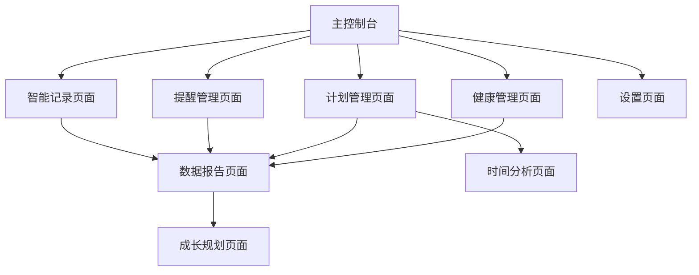

# 个人全生命周期管理AI助手 - 产品需求文档

## 1. 产品概述

个人全生命周期管理AI助手是一款由大模型驱动的智能个人管理应用，通过自然语言交互帮助用户管理记忆、时间、计划、健康等生活各个维度。

产品旨在解决现代人记忆负担重、时间管理混乱、健康追踪困难等问题，为用户提供个性化的AI助手服务，支持跨设备同步使用。

目标是成为用户的智能生活伙伴，通过AI技术提升个人效率和生活质量，打造千万级用户的个人管理平台。

## 2. 核心功能

### 2.1 用户角色

| 角色 | 注册方式 | 核心权限 |
|------|----------|----------|
| 普通用户 | 手机号/邮箱注册 | 基础记录、提醒、计划功能，数据存储30天 |
| 高级用户 | 付费升级 | 全功能使用，无限数据存储，AI深度分析，跨设备同步 |

### 2.2 功能模块

我们的个人全生命周期管理AI助手包含以下主要页面：

1. **主控制台页面**：AI对话界面、今日概览、快捷操作入口
2. **智能记录页面**：语音/文字记录、历史记录查看、智能分类管理
3. **提醒管理页面**：提醒列表、场景设置、优先级管理
4. **计划管理页面**：多维度计划创建、进度追踪、完成度分析
5. **时间分析页面**：时间统计、效率分析、专注模式
6. **成长规划页面**：目标设定、里程碑管理、技能图谱
7. **健康管理页面**：运动记录、睡眠分析、饮食追踪
8. **数据报告页面**：周月报表、趋势分析、AI建议
9. **设置页面**：个人信息、同步设置、偏好配置

### 2.3 页面详情

| 页面名称 | 模块名称 | 功能描述 |
|----------|----------|----------|
| 主控制台页面 | AI对话界面 | 支持语音/文字输入，自然语言理解，智能响应和任务执行 |
| 主控制台页面 | 今日概览 | 显示今日待办、重要提醒、健康数据概览、天气信息 |
| 主控制台页面 | 快捷操作 | 一键记录、快速提醒、紧急任务、健康打卡等快捷入口 |
| 智能记录页面 | 对话式记录 | 语音识别、文字输入、方言支持、模糊语义理解 |
| 智能记录页面 | 智能归类 | 自动标签分类（工作/生活/学习/琐事）、自定义标签、关键词搜索 |
| 智能记录页面 | 每日笔记 | 自动汇总当天记录、时间线整理、手动编辑、导出功能 |
| 提醒管理页面 | 场景化提醒 | 定时提醒、地理位置触发、情境感知提醒 |
| 提醒管理页面 | 优先级管理 | AI智能排序、紧急程度识别、重要事项置顶 |
| 提醒管理页面 | 重复提醒 | 周期性任务设置、逐级加强提醒、完成状态跟踪 |
| 计划管理页面 | 多维度计划 | 工作计划、生活计划、学习计划的创建和管理 |
| 计划管理页面 | 进度追踪 | 任务状态更新、每日签到、原因分析、进度可视化 |
| 计划管理页面 | 完成度分析 | 周月报表生成、拖延分析、AI优化建议 |
| 时间分析页面 | 定时任务 | 专注模式启动、通知屏蔽、用时统计、中断记录 |
| 时间分析页面 | 时间追踪 | APP使用时长、线下活动记录、时间分配饼图 |
| 时间分析页面 | 效率优化 | 时间浪费识别、替代方案推荐、效率提升建议 |
| 成长规划页面 | 目标拆解 | 长期目标输入、AI智能拆解、短期目标关联 |
| 成长规划页面 | 里程碑管理 | 关键节点设置、成就徽章、成长轨迹总结 |
| 成长规划页面 | 技能图谱 | 技能记录、学习路径推荐、资源关联 |
| 健康管理页面 | 运动记录 | 手动输入、APP数据同步、AI运动计划推荐 |
| 健康管理页面 | 睡眠分析 | 睡眠数据同步、规律分析、睡眠建议生成 |
| 健康管理页面 | 饮食追踪 | 拍照识别、热量计算、营养分析、食谱推荐 |
| 数据报告页面 | 统计报表 | 各维度数据汇总、图表展示、趋势分析 |
| 数据报告页面 | AI分析 | 个性化洞察、行为模式识别、改进建议 |
| 设置页面 | 个人信息 | 基本资料、健康档案、偏好设置 |
| 设置页面 | 同步设置 | 跨设备同步、数据备份、隐私控制 |

## 3. 核心流程

**普通用户流程：**
用户通过主控制台进行AI对话，记录想法和任务 → 系统智能归类并设置提醒 → 用户在提醒管理页面查看和管理提醒 → 通过计划管理页面创建和跟踪计划 → 在健康管理页面记录健康数据 → 查看数据报告了解个人状态。

**高级用户流程：**
除普通用户功能外，还可以使用成长规划页面设定长期目标 → AI拆解为可执行计划 → 通过时间分析页面优化时间利用 → 获得深度的AI分析和个性化建议 → 跨设备无缝同步使用。

## 4. 用户界面设计

### 4.1 设计风格

- **主色调**：深蓝色(#1E3A8A)作为主色，浅蓝色(#3B82F6)作为辅助色，营造专业可信赖感
- **按钮样式**：圆角矩形按钮，支持渐变效果和微动画反馈
- **字体**：中文使用苹方/微软雅黑，英文使用Roboto，主要字号16px，标题20px
- **布局风格**：卡片式设计，顶部导航栏，底部Tab栏，支持手势操作
- **图标风格**：线性图标配合实心图标，统一使用Feather Icons风格，支持AI相关的智能图标

### 4.2 页面设计概览

| 页面名称 | 模块名称 | UI元素 |
|----------|----------|--------|
| 主控制台页面 | AI对话界面 | 聊天气泡设计，语音波形动画，渐变背景(#1E3A8A到#3B82F6)，底部输入框带麦克风图标 |
| 主控制台页面 | 今日概览 | 卡片式布局，圆形进度条，彩色标签，天气图标，数字徽章提醒 |
| 智能记录页面 | 对话式记录 | 时间轴设计，语音录制按钮(红色#EF4444)，文字输入框，标签云展示 |
| 提醒管理页面 | 提醒列表 | 列表项左滑操作，优先级颜色标识(红橙黄绿)，时间倒计时显示 |
| 计划管理页面 | 进度追踪 | 甘特图样式，进度条动画，完成度饼图，签到打卡按钮 |
| 健康管理页面 | 数据展示 | 仪表盘设计，曲线图表，健康评分环形图，拍照上传按钮 |
| 数据报告页面 | 统计图表 | 多彩柱状图，趋势折线图，热力图日历，AI洞察卡片 |

### 4.3 响应式设计

产品采用移动端优先设计，手机端注重触控体验和语音交互，电脑端适配大屏幕显示和复杂操作需求。支持横竖屏切换，针对平板设备优化布局，确保跨设备一致的用户体验。