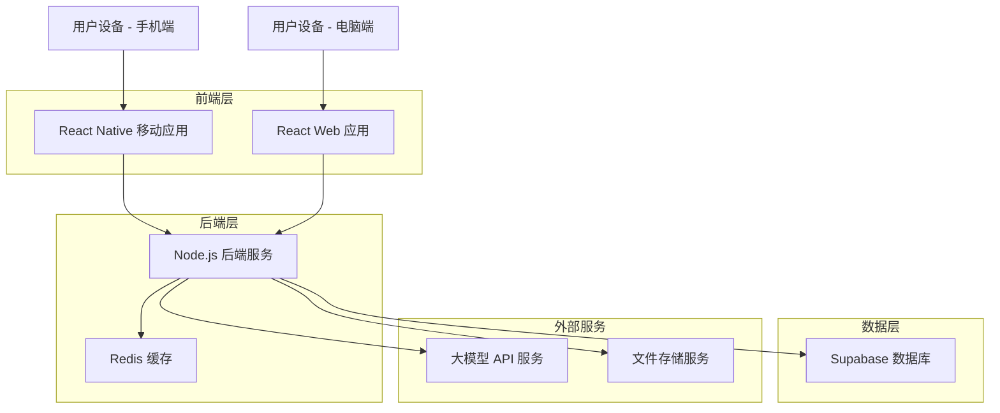
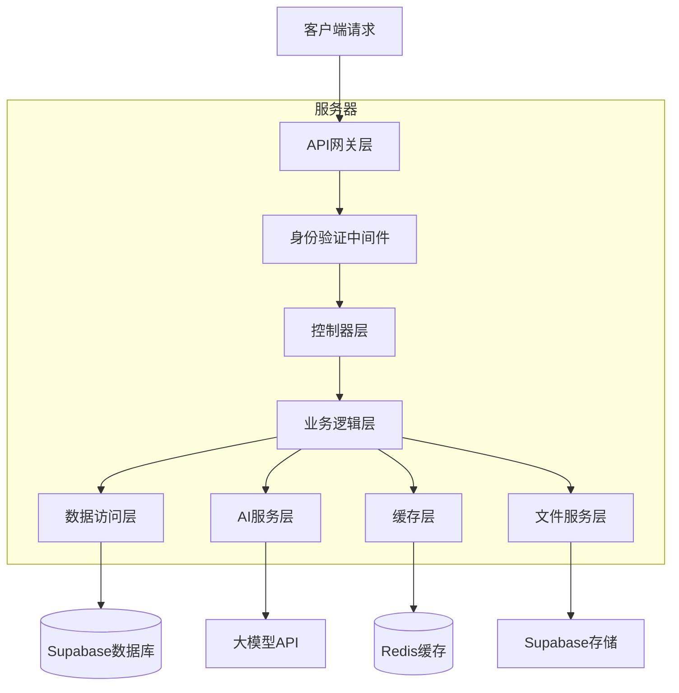
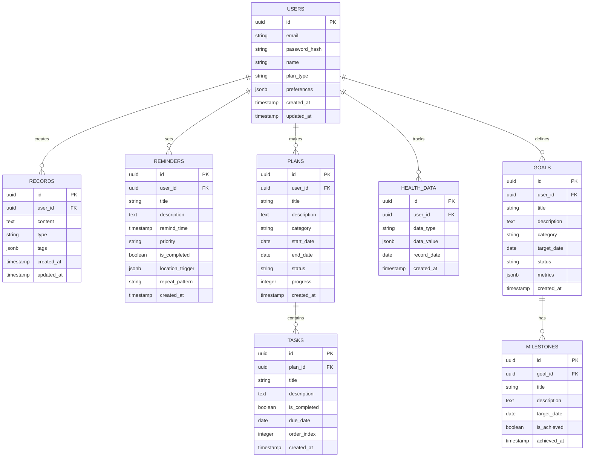

# 个人全生命周期管理AI助手 - 技术架构文档

## 1. 架构设计



## 2. 技术描述

* 前端：React Native\@0.72 + React\@18 + TypeScript + Expo (移动端)，React\@18 + TypeScript + Vite + TailwindCSS (Web端)

* 后端：Node.js\@18 + Express\@4 + TypeScript

* 数据库：Supabase (PostgreSQL)

* 缓存：Redis\@7

* AI服务：OpenAI GPT-4 / Claude API

* 文件存储：Supabase Storage

* 实时通信：Socket.io

## 3. 路由定义

| 路由             | 用途                 |
| -------------- | ------------------ |
| /              | 主控制台页面，AI对话界面和今日概览 |
| /records       | 智能记录页面，查看和管理历史记录   |
| /reminders     | 提醒管理页面，设置和查看提醒事项   |
| /plans         | 计划管理页面，创建和跟踪各类计划   |
| /time-analysis | 时间分析页面，时间统计和效率分析   |
| /growth        | 成长规划页面，目标设定和技能管理   |
| /health        | 健康管理页面，运动睡眠饮食追踪    |
| /reports       | 数据报告页面，统计分析和AI洞察   |
| /settings      | 设置页面，个人信息和系统配置     |
| /auth/login    | 登录页面               |
| /auth/register | 注册页面               |

## 4. API定义

### 4.1 核心API

**用户认证相关**

```
POST /api/auth/login
```

请求参数：

| 参数名      | 参数类型   | 是否必需 | 描述   |
| -------- | ------ | ---- | ---- |
| email    | string | true | 用户邮箱 |
| password | string | true | 用户密码 |

响应参数：

| 参数名     | 参数类型    | 描述      |
| ------- | ------- | ------- |
| success | boolean | 登录是否成功  |
| token   | string  | JWT访问令牌 |
| user    | object  | 用户基本信息  |

**AI对话接口**

```
POST /api/ai/chat
```

请求参数：

| 参数名     | 参数类型   | 是否必需  | 描述               |
| ------- | ------ | ----- | ---------------- |
| message | string | true  | 用户输入的消息          |
| context | object | false | 对话上下文信息          |
| type    | string | false | 消息类型(text/voice) |

响应参数：

| 参数名      | 参数类型   | 描述      |
| -------- | ------ | ------- |
| response | string | AI回复内容  |
| actions  | array  | 建议的操作列表 |
| entities | object | 提取的实体信息 |

**记录管理接口**

```
POST /api/records
GET /api/records
PUT /api/records/:id
DELETE /api/records/:id
```

**提醒管理接口**

```
POST /api/reminders
GET /api/reminders
PUT /api/reminders/:id
DELETE /api/reminders/:id
```

**计划管理接口**

```
POST /api/plans
GET /api/plans
PUT /api/plans/:id
DELETE /api/plans/:id
POST /api/plans/:id/tasks
```

**健康数据接口**

```
POST /api/health/exercise
POST /api/health/sleep
POST /api/health/nutrition
GET /api/health/summary
```

## 5. 服务器架构图



## 6. 数据模型

### 6.1 数据模型定义



### 6.2 数据定义语言

**用户表 (users)**

```sql
-- 创建用户表
CREATE TABLE users (
    id UUID PRIMARY KEY DEFAULT gen_random_uuid(),
    email VARCHAR(255) UNIQUE NOT NULL,
    password_hash VARCHAR(255) NOT NULL,
    name VARCHAR(100) NOT NULL,
    plan_type VARCHAR(20) DEFAULT 'free' CHECK (plan_type IN ('free', 'premium')),
    preferences JSONB DEFAULT '{}',
    created_at TIMESTAMP WITH TIME ZONE DEFAULT NOW(),
    updated_at TIMESTAMP WITH TIME ZONE DEFAULT NOW()
);

-- 创建索引
CREATE INDEX idx_users_email ON users(email);
CREATE INDEX idx_users_plan_type ON users(plan_type);

-- 设置权限
GRANT SELECT ON users TO anon;
GRANT ALL PRIVILEGES ON users TO authenticated;
```

**记录表 (records)**

```sql
-- 创建记录表
CREATE TABLE records (
    id UUID PRIMARY KEY DEFAULT gen_random_uuid(),
    user_id UUID NOT NULL REFERENCES users(id) ON DELETE CASCADE,
    content TEXT NOT NULL,
    type VARCHAR(50) DEFAULT 'text' CHECK (type IN ('text', 'voice', 'image')),
    tags JSONB DEFAULT '[]',
    created_at TIMESTAMP WITH TIME ZONE DEFAULT NOW(),
    updated_at TIMESTAMP WITH TIME ZONE DEFAULT NOW()
);

-- 创建索引
CREATE INDEX idx_records_user_id ON records(user_id);
CREATE INDEX idx_records_created_at ON records(created_at DESC);
CREATE INDEX idx_records_tags ON records USING GIN(tags);

-- 设置权限
GRANT SELECT ON records TO anon;
GRANT ALL PRIVILEGES ON records TO authenticated;
```

**提醒表 (reminders)**

```sql
-- 创建提醒表
CREATE TABLE reminders (
    id UUID PRIMARY KEY DEFAULT gen_random_uuid(),
    user_id UUID NOT NULL REFERENCES users(id) ON DELETE CASCADE,
    title VARCHAR(200) NOT NULL,
    description TEXT,
    remind_time TIMESTAMP WITH TIME ZONE,
    priority VARCHAR(20) DEFAULT 'medium' CHECK (priority IN ('low', 'medium', 'high', 'urgent')),
    is_completed BOOLEAN DEFAULT FALSE,
    location_trigger JSONB,
    repeat_pattern VARCHAR(50),
    created_at TIMESTAMP WITH TIME ZONE DEFAULT NOW()
);

-- 创建索引
CREATE INDEX idx_reminders_user_id ON reminders(user_id);
CREATE INDEX idx_reminders_remind_time ON reminders(remind_time);
CREATE INDEX idx_reminders_priority ON reminders(priority);

-- 设置权限
GRANT SELECT ON reminders TO anon;
GRANT ALL PRIVILEGES ON reminders TO authenticated;
```

**计划表 (plans)**

```sql
-- 创建计划表
CREATE TABLE plans (
    id UUID PRIMARY KEY DEFAULT gen_random_uuid(),
    user_id UUID NOT NULL REFERENCES users(id) ON DELETE CASCADE,
    title VARCHAR(200) NOT NULL,
    description TEXT,
    category VARCHAR(50) DEFAULT 'personal' CHECK (category IN ('work', 'personal', 'study', 'health')),
    start_date DATE,
    end_date DATE,
    status VARCHAR(20) DEFAULT 'active' CHECK (status IN ('active', 'completed', 'paused', 'cancelled')),
    progress INTEGER DEFAULT 0 CHECK (progress >= 0 AND progress <= 100),
    created_at TIMESTAMP WITH TIME ZONE DEFAULT NOW()
);

-- 创建索引
CREATE INDEX idx_plans_user_id ON plans(user_id);
CREATE INDEX idx_plans_category ON plans(category);
CREATE INDEX idx_plans_status ON plans(status);

-- 设置权限
GRANT SELECT ON plans TO anon;
GRANT ALL PRIVILEGES ON plans TO authenticated;
```

**健康数据表 (health\_data)**

```sql
-- 创建健康数据表
CREATE TABLE health_data (
    id UUID PRIMARY KEY DEFAULT gen_random_uuid(),
    user_id UUID NOT NULL REFERENCES users(id) ON DELETE CASCADE,
    data_type VARCHAR(50) NOT NULL CHECK (data_type IN ('exercise', 'sleep', 'nutrition', 'weight', 'blood_pressure')),
    data_value JSONB NOT NULL,
    record_date DATE NOT NULL,
    created_at TIMESTAMP WITH TIME ZONE DEFAULT NOW()
);

-- 创建索引
CREATE INDEX idx_health_data_user_id ON health_data(user_id);
CREATE INDEX idx_health_data_type ON health_data(data_type);
CREATE INDEX idx_health_data_date ON health_data(record_date DESC);

-- 设置权限
GRANT SELECT ON health_data TO anon;
GRANT ALL PRIVILEGES ON health_data TO authenticated;
```

**初始化数据**

```sql
-- 插入示例用户
INSERT INTO users (email, password_hash, name, plan_type) VALUES
('demo@example.com', '$2b$10$example_hash', '演示用户', 'premium');

-- 插入示例记录
INSERT INTO records (user_id, content, type, tags) VALUES
((SELECT id FROM users WHERE email = 'demo@example.com'), '明天下午3点开会讨论项目进展', 'text', '["工作", "会议"]');

-- 插入示例提醒
INSERT INTO reminders (user_id, title, description, remind_time, priority) VALUES
((SELECT id FROM users WHERE email = 'demo@example.com'), '项目会议', '讨论Q4项目进展和里程碑', '2024-01-15 15:00:00+08', 'high');
```

